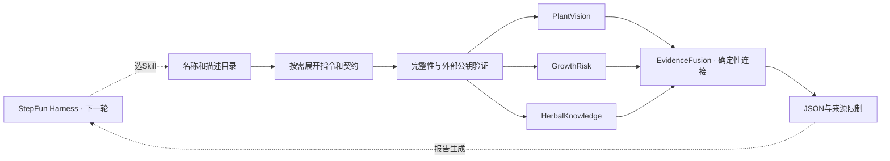

# PhytoSkill-Spark · 可组合的中药植物 Agent Skills

PhytoSkill-Spark 将药用植物异常研判拆成四个可独立发现、调用和验证的专家能力包。Skill 是交付物，StepFun 是规划与报告生成者，DGX Spark 是计划中的本地执行底座。每个包包含指令、脚本、契约、来源说明和评测用例，调用方按任务加载所需能力。

**当前0.2.0已完成SDK、Registry、四个Skill接口、确定性证据融合、离线fixture组合与失败降级，以及真实Agent Harness（`harness/`）。** 演示仍由脚本调度，`artifacts/` 中已有的报告未调用StepFun、YOLO、TCM-Mind-RAG或DGX GPU。Harness已实现并带38项离线测试，但**本仓库内尚无真实端点调用记录**：它需要在配置端点与密钥后运行，步骤见[真实Harness](docs/harness.md)。

## 立即运行

需要Python 3.11+，PowerShell示例：

```powershell
Set-Location 'D:\DRX SPARK\phytoagent-skills'
python -m venv .venv
.\.venv\Scripts\python.exe -m pip install -e '.[test]'
.\.venv\Scripts\python.exe -m demo.run_demo
.\.venv\Scripts\python.exe -m evals.run_contracts
.\.venv\Scripts\python.exe -m pytest -q
```

已有依赖时，可直接使用当前Python：

```powershell
python -m demo.run_demo --output artifacts/four-skills-demo.json
python -m demo.run_demo --simulate-failure herbal_knowledge --output artifacts/four-skills-degraded.json
python -m evals.run_contracts --output artifacts/skill-contract-evals.json
python -m pytest -q
```

Demo复制四个包到临时目录，生成临时开发密钥并签名，完成发现、按需展开、执行与融合。报告包含包哈希、tool_call_id、逐调用结果、耗时和缺失项；执行结束清理临时密钥。
正常演示返回 `completeness: complete`；知识来源失败时返回 `partial` 和 `missing_inputs: ["knowledge"]`。
complete仅指三路接口结果齐备，不代表诊断证据充分。所有结果仍为synthetic_fixture。

## 四个Skill

| 包 / Tool函数名 | 任务 | 当前实现 |
| --- | --- | --- |
| plant_vision | 图像异常表型与区域 | 指定黄芪案例的合成观察，未读取图片 |
| growth_risk | 环境因素与缺失背景 | 合成因素；未核实物种阈值，risk_level保持undetermined |
| herbal_knowledge | 知识证据和出处 | 合成条目，明确不是真实文献 |
| evidence_fusion | 同一案例的证据ID连接 | 确定性连接逻辑真实执行；仅接收fixture来源 |

前三个Skill精确匹配fixture请求。更换图片、物种、案例ID或测量值会明确失败，不能用同一份合成输出回答真实输入。
融合不调用模型，不承担Agent调度。它检查案例和物种一致性、证据ID唯一性及区域有效性，只连接适用表型匹配的证据，保留未连接条目。
某路失败用null表示，融合列出缺失项，不伪造补齐。共同出现标记为co_occurrence_only，不把视觉分数与检索分数组成疾病概率。

## 工程结构

```text
phytoagent-skills/
├── sdk/                   BaseSkill、契约、Manifest、fixture约束、CLI
├── registry/              发现、按需加载、签名校验、Tool Schema导出
├── runtime/executor.py    校验后执行源码、保留调用ID、结构化错误
├── harness/               真实StepFun调度：配置、传输、工具循环、任务集、规则化评分、A/B
├── skills/
│   ├── plant_vision/
│   ├── growth_risk/
│   ├── herbal_knowledge/
│   └── evidence_fusion/
├── demo/                  正常组合与失败演示、第一轮SDK示例
├── evals/                 包内fixture契约评测器
├── scripts/seal_skills.py  发布者显式封包
├── examples/              最小SDK示例
├── tests/                 SDK、签名、调用、组合、降级测试
└── docs/                  比赛对照、开发日志、分轮范围
```

每个领域Skill含SKILL.md、scripts/run.py、references/contract.md、evals/evals.json、skill-card.md、BENCHMARK.md、skill.py、schema.json、fixture.json、examples/request.json、metadata.json和manifest.json。



## 发现与按需加载

```python
from registry import SkillRegistry
from runtime.executor import SkillExecutor

registry = SkillRegistry("skills", trusted_public_key=".trust/publisher.public.pem")
registry.discover()
catalog = registry.catalog                      # 仅名称与描述
selected = registry.load_skill("plant_vision")  # 命中包的正文、契约、验证记录
tool = selected["tool"]                          # StepFun/OpenAI风格function
result = SkillExecutor(registry).execute("plant_vision", {
    "case_id": "demo-huangqi-001", "species": "黄芪",
    "image_path": "fixture://huangqi-leaf-01",
}, mode="fixture")
```

上例需要先签名各源包。无密钥时直接运行Demo，它使用临时签名副本。
Registry发现阶段不导入Python；失败不发布部分快照。load_skill、instructions及执行器重验包，修改后需显式重新发现。
available_tools可导出所有输入契约；未来Harness应优先使用小目录和选中项，减少上下文占用。

函数名保持下划线风格，SKILL.md使用plant-vision等标准名称。Registry接受对应的下划线或连字符目录，拒绝两个别名重复注册同一函数。分发包可使用连字符目录，需要安装SDK依赖。

## 单独运行与发布

安装SDK后，从单个Skill目录执行：

```powershell
python scripts/run.py --input examples/request.json --mode fixture --allow-unsigned
```

allow-unsigned是显式开发模式，不会标记签名通过。正常消费端要求包外固定公钥：

```powershell
python -m registry keygen --private-key .trust/publisher.private.pem --public-key .trust/publisher.public.pem
python -m registry sign skills/plant_vision --private-key .trust/publisher.private.pem
python -m registry verify skills/plant_vision --public-key .trust/publisher.public.pem
```

生成密钥拒绝覆盖已有文件。修改自有Skill后，发布者审核并运行 `python -m scripts.seal_skills` 更新清单，再签各包。其他包也需签名后才能用默认配置发现全部目录。
验证和执行不会重算哈希来“修复”篡改。Registry配置中的相对路径以配置文件位置为基准。

## 治理与评测的实际范围

| 项目 | 当前状态 |
| --- | --- |
| Catalog / Documented | 四包可发现；含触发边界、说明、契约和Skill Card |
| Integrity / Signed | SHA-256文件与元数据清单；项目Ed25519签名；公钥在包外固定 |
| Fixture contracts | evals.run_contracts输出用例结果与包哈希 |
| Agent触发与A/B | 每包有正向、负向、缺参数用例；真实StepFun评测未运行 |
| SkillSpector / OMS | 未接入；没有NVIDIA官方Verified声明 |
| DGX / 模型准确率 | 未实测，不提供推算指标 |

资料中的skill.oms.sig属于OpenSSF Model Signing与NVIDIA证书链。manifest.sig是项目格式，两者不能互换。临时Demo密钥验证流程，不认证第三方发布者。
框架/fixture通过也不代表真实Agent行为、农学准确性或扫描通过；Registry的scanned/evaluated仍为not_checked。

同一Agent带/不带Skill的A/B应固定模型、端点、工具、任务和Harness，只改变Skill指令，比较安全、正确性、发现、有效性和效率。
完整对照见[比赛要求与技术资料](docs/competition-alignment.md)，开发记录见[十日谈第一天](docs/devlog/day-01.md)。

## 执行边界

SDK使用Draft 2020-12，只允许本地JSON Pointer引用；拒绝非有限数字、重复JSON键、越界路径和链接资源。输入输出根类型为对象，Tool Schema从契约直接生成。
执行器载入源码前检查模式和输入，并校验源码哈希，不执行未覆盖的缓存字节码。Python仍运行在本进程，尚无安全沙箱、并发文件修改隔离或强制超时；后续Harness与部署需处理这些约束。签名证明来源和完整性，不证明行为安全。

未实现的live/replay明确失败，不回退fixture。离线部分（Demo、契约评测、离线测试）不联网；`harness/`是唯一会发起网络请求的模块，必须显式配置端点与密钥，缺密钥直接报错而不是退回fixture。私钥不随源码发布；开发私钥为未加密PEM。

本仓库代码以Apache-2.0授权，见仓库根`LICENSE`。四个Skill包内的Skill Card仍标`NOASSERTION`：包内文件受Manifest哈希与Ed25519签名保护，改动后需重新封包并重签，因此许可尚未随源码同步，属已知遗留项。

## 后续真实集成

1. StepFun Harness：**已实现**（`harness/`）——配置`base_url`/`model`/密钥后即可完成选Skill、参数生成、tool_call_id关联、错误处理和最终报告，并跑正反例及A/B。运行前先`python -m harness preflight`，其中工具调用可用性与模型一致性两项不过，A/B结论无效。本轮尚未在真实端点跑过，报告中不出现真实调用记录。
2. PlantVision接既有YOLO/分割权重；HerbalKnowledge接TCM-Mind-RAG；GrowthRisk接核实过的物种/生育期规则。记录来源和版本，升级契约与评测后再声明live。
3. DGX Spark：在ARM64环境安装兼容依赖，通过NVIDIA推理栈执行视觉、embedding和向量检索；保留硬件、版本和调用日志后报告平台适配性。课件里的型号和修复参数需按实际环境核对。

若StepFun用云端点，系统包含云调用；全部本地需要可用本地模型和DGX实测。后续真实集成需要权重路径、TCM-Mind-RAG项目/接口说明及DGX连接信息。
